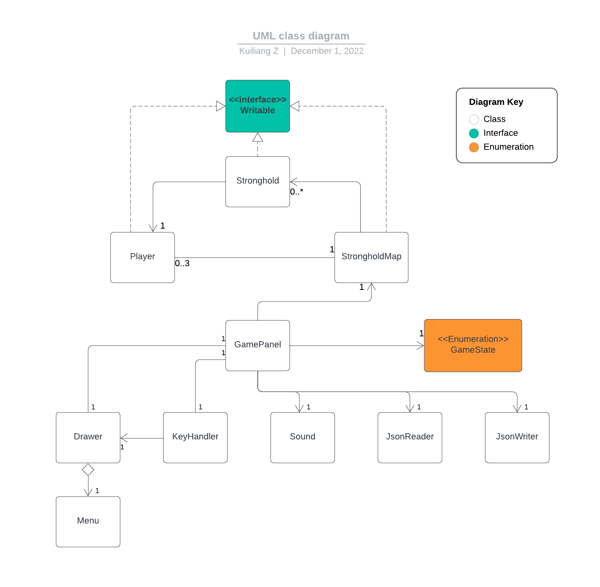

# My Personal Project

## What will the application do

This program is a local multiplayer game, supporting two to four players to play.
Players are placed in a two-dimensional map and each player is assigned a color. 
They color the map by moving around the map or using props.
After a certain amount of time, the game will settle the final color area as the final score for each player.

## Who will use it

Everyone is welcome to play the game.

## Why is this project interest to you

I've been thinking about how to design some fun party games 
that anyone can play at the party and enjoy the games.
This will promote friendship, unless they are overly concerned about winning or losing the game.

## User Stories

* As a player, I want to be able to add multiple strongholds in the map
* As a player, I want to move my character in the map
* As a player, I want to add and remove players can play in a game
* As a player, I want to view the final score of a game
* As a player, when I quit the unfinished match, I have the option to save all state of the match
* As a player, when I start the application, I want to be given the option to resume my last match from file.

# Instructions for Grader

* You can always use "W" and "S" to move the cursor of any menu, and hit "Enter" to confirm your choice
* You can generate the events related to select players to the game by
  * after starting game, hit "A" and "D" to choose player and hit "Enter" when selecting "ADD PLAYER" to add player
  * after starting game, use "A" and "D" to choose player and hit "Enter" when selecting "REMOVE PLAYER" to remove player
* You can add players to the map by hit "Enter" when selecting "START" in the player selection page
* You can change the position of players in the map by hitting "WSAD" and "IKJL" and arrow keys.
* You can generate the events related to adding strongholds to the map by
  * after starting a match, hit "WSAD" to occupy a new or existed strongholds and add it to the map
  * after starting a match, make a circle to gain bonus strongholds
* Player images are the visual components, you can find them in "./data/players"
* You can save the match by hitting "ESC" and select "SAVE AND QUIT MATCH" when playing in a match
* You can load the match by selecting "RESUME GAME" on title screen, i.e. the opening page of the game

# Phase 4: Task 2

## Sample of events

```
Thu Dec 01 15:24:11 PST 2022
A player is added to the map: playerId: 0, resourceId: 0

Thu Dec 01 15:24:11 PST 2022
A player is added to the map: playerId: 1, resourceId: 2

Thu Dec 01 15:24:11 PST 2022
Match Start!

Thu Dec 01 15:24:11 PST 2022
A new stronghold is added to the map: ownerId: 0, posX: 6, posY: 4

Thu Dec 01 15:24:11 PST 2022
A new stronghold is added to the map: ownerId: 1, posX: 6, posY: 12

Thu Dec 01 15:24:12 PST 2022
A new stronghold is added to the map: ownerId: 0, posX: 6, posY: 5

Thu Dec 01 15:24:12 PST 2022
A stronghold is occupied by a player: playerId: 0, posX: 6, posY: 5

Thu Dec 01 15:24:12 PST 2022
A player changed its position on the map: playerId: 0, posX: 6, posY: 5

Thu Dec 01 15:24:13 PST 2022
A new stronghold is added to the map: ownerId: 1, posX: 6, posY: 11

Thu Dec 01 15:24:13 PST 2022
A stronghold is occupied by a player: playerId: 1, posX: 6, posY: 11

Thu Dec 01 15:24:13 PST 2022
A player changed its position on the map: playerId: 1, posX: 6, posY: 11

Thu Dec 01 15:24:13 PST 2022
A new stronghold is added to the map: ownerId: 1, posX: 5, posY: 11

Thu Dec 01 15:24:13 PST 2022
A stronghold is occupied by a player: playerId: 1, posX: 5, posY: 11

Thu Dec 01 15:24:13 PST 2022
A new stronghold is added to the map: ownerId: 1, posX: 4, posY: 11

Thu Dec 01 15:24:13 PST 2022
A stronghold is occupied by a player: playerId: 1, posX: 4, posY: 11

Thu Dec 01 15:24:15 PST 2022
A stronghold is occupied by a player: playerId: 0, posX: 6, posY: 4

Thu Dec 01 15:24:15 PST 2022
A player changed its position on the map: playerId: 0, posX: 6, posY: 4
```

## Task 2 Explanation

### What events are covered in log?

1. add strongholds to the map
2. change or set the owner of strongholds on the map, i.e. players can occupy strongholds
3. add players to the map
4. change the position of players on the map

### What event is not covered in log?

remove a player On "CHOOSING PLAYER" page before starting a match

### Why removing a player is not covered?

On "CHOOSING PLAYER" page, when we choose a player, 
the program only changes the UI and store the id as the temporary local variable in playerStack.
Only after we hit "START", players are created and assigned to the proper positions on the map.

Therefore, when we remove a player, we actually remove an id from playerStack in ui package.
In other words, players are not actually removed because they have not been created before the match starts.
We do not create Event in ui package so removing a player is not covered in log.

# Phase 4: Task 3



## Refactoring to improve the design
1. Create an abstract class called VisualComponent. Then Menu and other visual components should extend it.
   In the future, if we need to draw new visual components, we extend this abstract class.
   This class should have the fields like posX and posY to control where to display them, and have methods like scale to scale them.
   In addition, Drawer can have a Collection to store all of them and render them in a loop.
    1. Reason: The current design is poorly expandable. Also, Drawer does too much work adjusting component colors, sizes, etc.
    2. Benefits: High expandability and functional separation
2. Apply Singleton Pattern for StrongholdMap class
   1. Reason: There are only one StrongholdMap all the time.
   2. Benefits: Make sure there is only one map.
   and do not need to create fields for Stronghold in Player, GamePanel classes.
3. Apply Singleton Pattern for Drawer class
   1. Reason and Befits are similar as StrongholdMap
4. Create a new class called Time to control the game time
   1. Reason: Now time control is integrated in StrongholdMap.
   But time control is not a simple module in this game. For example, a player is only allow to move once in every half a second.
   2. Benefits: Separating functionalities into different class is beneficial for debugging.
5. Move more sound control functionalities from GamePanel to Sound class, GamePanel just send GameState to Sound
   1. Reason: Now GamePanel implements too many sound control functionalities, 
   like choosing which song for different GameState
   2. Benefits: Sound class has completed and separated functionalities to control songs to play, pause and resume, 
   which is beneficial for debugging
6. Return immutable collections when we return data like playerList
   1. Reason: Sometimes we want to just return the data but not modify it
   2. Benefits: Safer